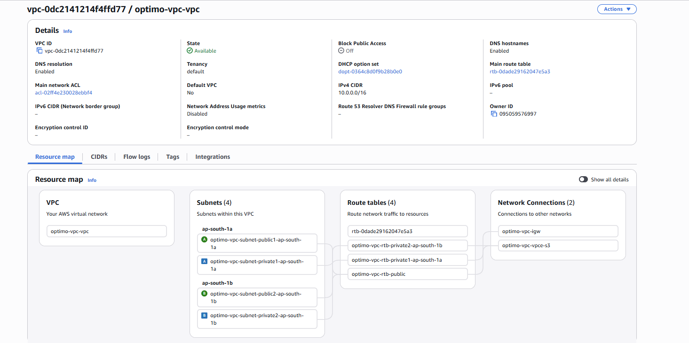
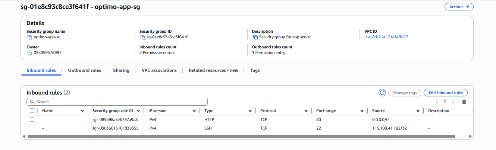
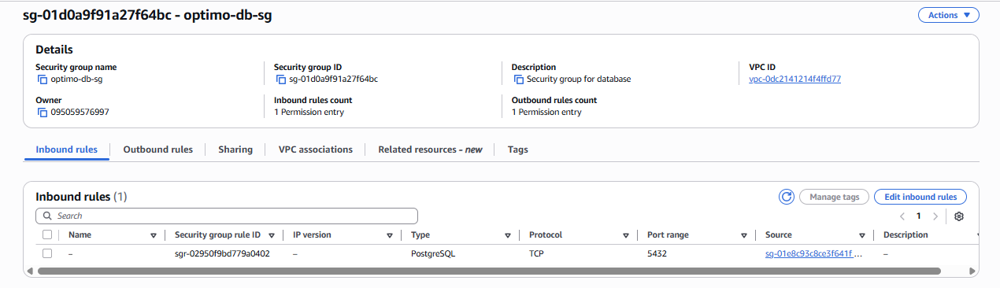
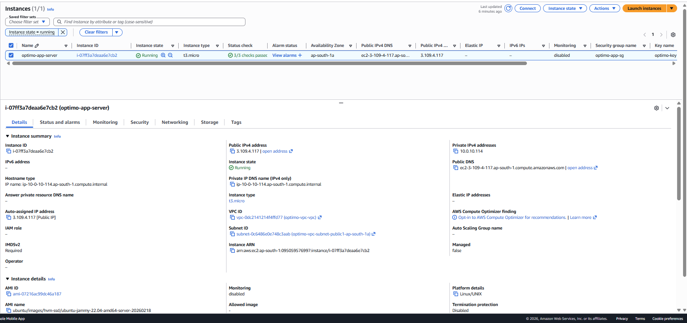
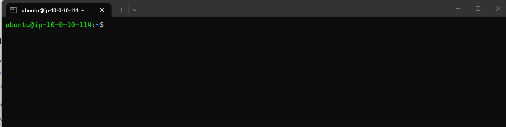
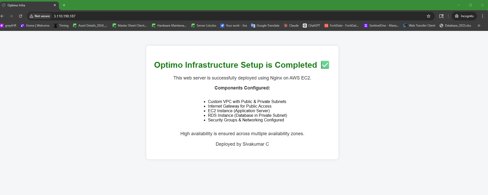
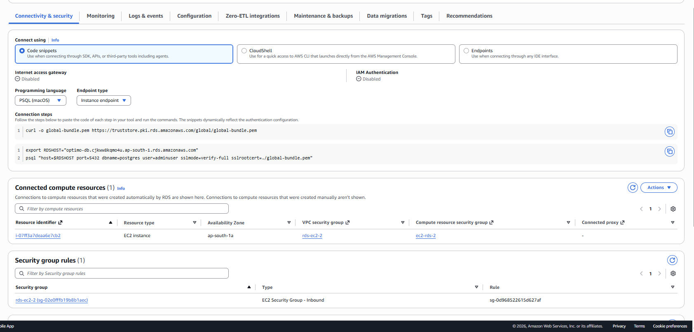
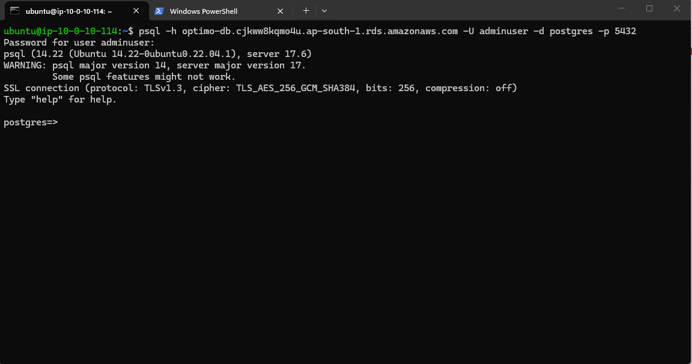

# AWS Infrastructure Assignment – Secure Web App Deployment

## 📌 Overview

This project demonstrates a secure and production-oriented AWS infrastructure for hosting a web application with a PostgreSQL database.

The architecture follows best practices:

* Separation of public and private resources
* Controlled network access
* Secure database deployment

---

## 🏗️ Architecture Overview

### Components Used:

* Custom VPC (10.0.0.0/16)
* Public Subnet (Application Layer)
* Private Subnet (Database Layer)
* EC2 Instance (Ubuntu + Nginx)
* RDS PostgreSQL
* Internet Gateway
* Security Groups

### Architecture Flow:

Client → Internet → EC2 (Public Subnet) → RDS (Private Subnet)

---

## 📸 Infrastructure Proof

### 1. VPC and Subnet Design



---

### 2. Security Groups Configuration

#### App Security Group (EC2)



#### Database Security Group (RDS)



---

### 3. EC2 Instance Running



---

### 4. SSH Access to EC2



---

### 5. Web Server Running (Nginx)



---

### 6. RDS Instance Available


---

### 7. EC2 to RDS Connectivity



---

### 8. PostgreSQL Connection Success



---

## 🌐 Networking Design

### VPC

* CIDR: 10.0.0.0/16

### Subnets

* Public Subnet:

  * Hosts EC2
  * Internet access via Internet Gateway
* Private Subnet:

  * Hosts RDS
  * No direct internet access

### Routing

* Public Route Table:

  * 0.0.0.0/0 → Internet Gateway
* Private Route Table:

  * No internet route (isolated)

### Design Decisions

* Database is placed in private subnet to improve security
* Only EC2 can access RDS using Security Group rules

---

## 🔐 Security Design

### EC2 Security Group

* Allow HTTP (80) from anywhere
* Allow SSH (22) only from my IP
* Outbound: Allow all

### RDS Security Group

* Allow PostgreSQL (5432) only from EC2 Security Group

### Security Best Practices

* Database is not publicly accessible
* No open database ports to internet
* Restricted SSH access
* Internal communication via private IP

---

## ⚙️ Setup Steps (Manual)

### Step 1: Create VPC

* CIDR: 10.0.0.0/16

### Step 2: Create Subnets

* Public Subnet (for EC2)
* Private Subnet (for RDS)

### Step 3: Configure Internet Gateway

* Attach IGW to VPC
* Associate with public route table

### Step 4: Launch EC2 Instance

* Ubuntu AMI
* Install Nginx:

```bash
sudo apt update
sudo apt install nginx -y
```

### Step 5: Create RDS PostgreSQL

* Private subnet
* Disable public access

### Step 6: Configure Security Groups

* EC2 → allow HTTP & SSH
* RDS → allow only EC2 SG

### Step 7: Connect EC2 to RDS

```bash
psql -h <rds-endpoint> -U adminuser -d postgres -p 5432
```

---

## 🔄 DevOps Practices

### Current Approach

* Infrastructure created manually via AWS Console

### Improvements (Future)

* Use Terraform for Infrastructure as Code
* Automate provisioning
* Version control infrastructure

---

## 📈 Scalability & Reliability

### Current Limitations

* Single EC2 instance
* Single RDS instance

### Scaling Strategy

* Add Application Load Balancer (ALB)
* Use Auto Scaling Group
* Enable RDS Multi-AZ

### Reliability Improvements

* Health checks via ALB
* Automated failover for DB

---

## 💰 Cost Estimation

### Monthly Cost (Approx)

| Service            | Cost           |
| ------------------ | -------------- |
| EC2 (t3.micro)     | ~$8            |
| RDS (db.t4g.micro) | ~$15           |
| Storage            | ~$5            |
| Data Transfer      | ~$2            |
| **Total**          | **~$30/month** |

### Cost Optimization

* No NAT Gateway (avoided high cost)
* Used small instance sizes
* Minimal resources

### Hidden Costs

* NAT Gateway (~$30/month)
* Data transfer charges
* Storage scaling

---

## ⚠️ Trade-offs

* Did not use NAT Gateway to reduce cost
* No Load Balancer (kept simple)
* Manual setup instead of IaC

---

## 🚀 Future Enhancements

* Terraform implementation
* CI/CD pipeline
* HTTPS (SSL via ACM)
* Secrets Manager for credentials
* CloudWatch monitoring

---

## ✅ Conclusion

This project demonstrates a secure AWS infrastructure with proper network isolation, controlled access, and production-oriented design decisions while keeping cost efficiency in mind.

---
